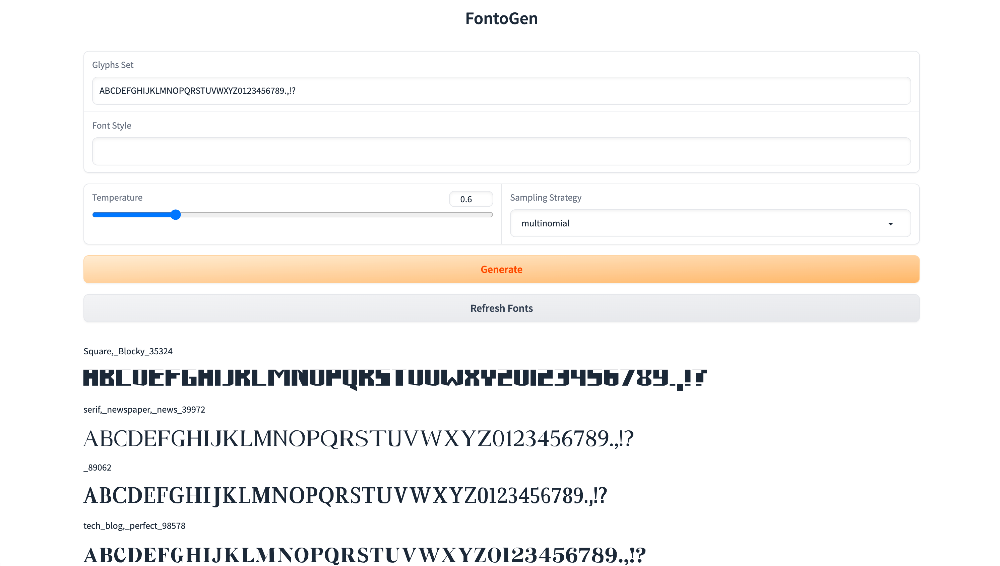

# FontoGen

Generate your very own font with FontoGen. Read more about the project in
my [blog article](https://serce.me/posts/02-10-2023-hey-computer-make-me-a-font).



## Installation

```bash
pipenv install
pipenv shell
# Nightly Triton is required
pip install -U --index-url https://aiinfra.pkgs.visualstudio.com/PublicPackages/_packaging/Triton-Nightly/pypi/simple/ triton-nightly==2.1.0.dev20230801015042 --no-deps
```

#### Inference

1. Download the model from huggingface, and place it within ./models/
2. Start the server

```bash
pipenv shell
python server.py
```

3. Select the model in the dropdown, and click "Generate"